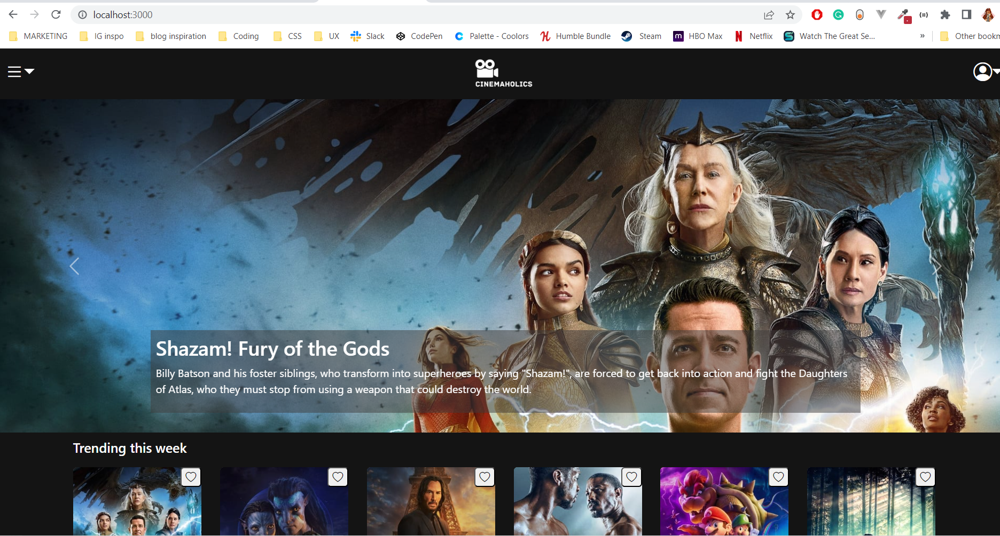
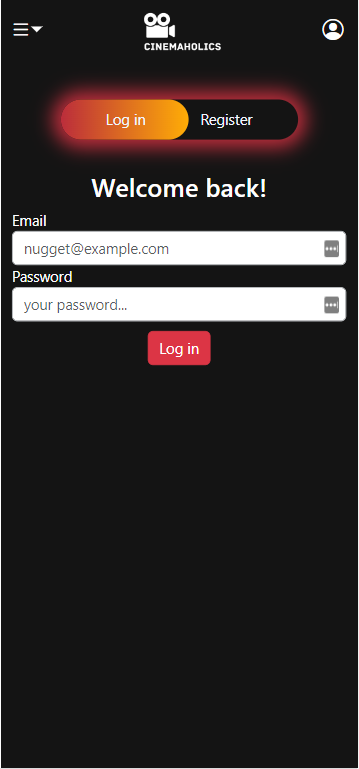
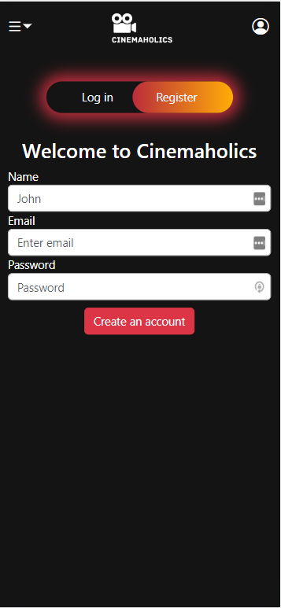
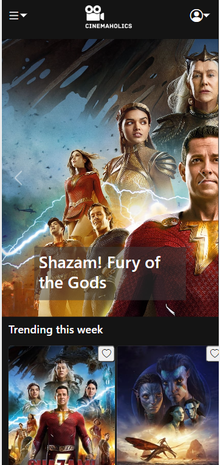

# CINEMAHOLICS (using TMDB API) movie website

Cinemaholics is a movie and TV show browsing app powered by the TMDB API. This app is designed to provide you with an immersive movie and TV show experience, allowing you to browse, discover and explore all the latest content in the world of cinema.

## Features:

The Cinemaholics app comes loaded with a variety of features, including:

- Browse movies and TV shows: Cinemaholics allows you to browse movies and TV shows with ease, thanks to the powerful TMDB API integration.
- See trending movies this week
- See upcoming movies
- See popular actors and actress
- Create an account
- Log in to your account

### Run the project

To run this project you will need to set some environment variables.

### `npm start` on both client and main

1. Create a new file called .env inside the client folder.
2. Create a new env file in main folder .
3. Run npm install on both main folder and client.
4. Run npm run migrate on the back end to get Data base.

## Install

Run "npm install" in project directory.
This will install server-related dependencies such as express.

### API info

- in this project I was using the TMDB database ("https://www.themoviedb.org/")
- This is a little tutorial on how to use it ("https://www.youtube.com/watch?v=FlFyrOEz2S4&t=2s")

API wrappers or libraries:

- https://www.themoviedb.org/documentation/api/wrappers-libraries

API documentation:

- https://developers.themoviedb.org/3/authentication/how-do-i-generate-a-session-id

## Technologies

- VS Code  
- HTML5
- ES6 JavaScript  
- React  
- Git/Github
- React js
- MySql
- Node js
- Bootstrap
- bcrypt

## Backend tables

Db name= cinemaholics
Db tables= users

## Website overview

